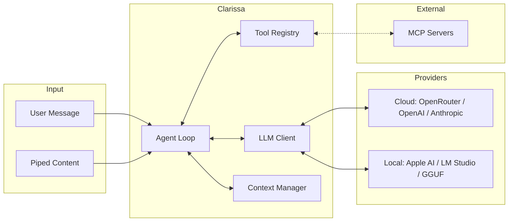
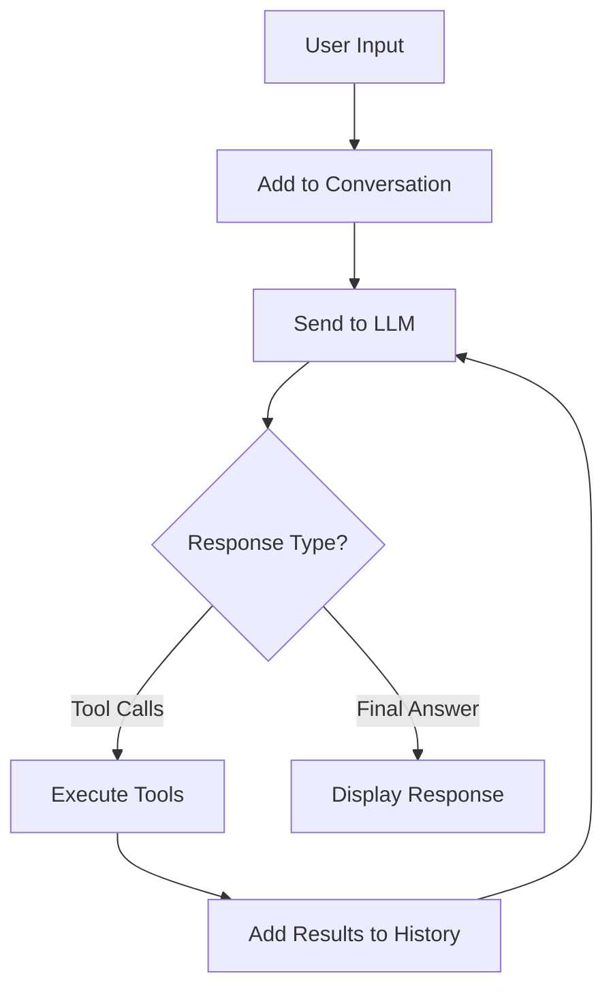

<p align="center">
  
</p>

<h1 align="center">Clarissa</h1>

<p align="center">
  An AI-powered terminal assistant with tool execution capabilities
</p>

<p align="center">
  <a href="https://www.npmjs.com/package/clarissa"></a>
  <a href="https://github.com/cameronrye/clarissa/blob/main/LICENSE"></a>
  <a href="https://bun.sh"></a>
  <a href="https://github.com/cameronrye/clarissa"></a>
</p>

---

Clarissa is a command-line AI agent built with [Bun](https://bun.sh) and [Ink](https://github.com/vadimdemedes/ink). It supports multiple LLM providers including cloud services like [OpenRouter](https://openrouter.ai), OpenAI, and Anthropic, as well as local inference via Apple Intelligence, LM Studio, and local GGUF models. The agent can execute tools, manage files, run shell commands, and integrate with external services via the Model Context Protocol (MCP).

## Features

- **Multi-provider support** - Use cloud providers (OpenRouter, OpenAI, Anthropic) or run completely offline with local models
- **Apple Intelligence** - On-device AI using Apple Foundation Models with full tool calling support (macOS 26+)
- **Local model inference** - Run GGUF models locally via LM Studio or node-llama-cpp with GPU acceleration
- **Streaming responses** - Real-time token streaming for responsive conversations
- **Built-in tools** - File operations, Git integration, shell commands, web fetching, and more
- **MCP integration** - Connect to external MCP servers to extend functionality
- **Session management** - Auto-save on exit, quick resume with `/last`, and named sessions
- **Memory persistence** - Remember facts across sessions with `/remember` and `/memories`
- **Context management** - Automatic token tracking and context truncation
- **Tool confirmation** - Approve or reject potentially dangerous operations
- **One-shot mode** - Run single commands directly from your shell with query history
- **Auto-updates** - Get notified of new versions and upgrade easily with `clarissa upgrade`

## How It Works

Clarissa implements the **ReAct (Reasoning + Acting) agent pattern**, where an LLM reasons about tasks and takes actions through tool execution in an iterative loop.

### Architecture Overview



The system connects your terminal to various LLM providers. When you ask Clarissa to perform a task, it:

1. Sends your message to the LLM along with available tool definitions
2. Receives a response that may include tool calls (e.g., read a file, run a command)
3. Executes the requested tools and feeds results back to the LLM
4. Repeats until the LLM provides a final answer

### The ReAct Loop



This loop continues until the LLM responds without requesting any tools, indicating it has completed the task. A maximum iteration limit prevents infinite loops.

### Key Concepts

| Concept | Description |
|---------|-------------|
| **Tool Confirmation** | Potentially dangerous tools (file writes, shell commands) require approval before execution. Use `/yolo` to auto-approve. |
| **Context Management** | Clarissa tracks token usage and automatically truncates older messages when approaching the model's context limit. |
| **Session Persistence** | Conversations can be saved to `~/.clarissa/sessions/` and restored later with `/save` and `/load`. |
| **Memory System** | Use `/remember` to store facts that persist across sessions and are included in every conversation. |
| **MCP Extensibility** | Connect to [Model Context Protocol](https://modelcontextprotocol.io/) servers to add custom tools without modifying Clarissa's code. |

For detailed architecture documentation, see the [Architecture Guide](https://cameronrye.github.io/clarissa/docs/architecture/).

## Requirements

- [Bun](https://bun.sh) v1.0 or later (for running from source or npm install)
- For cloud providers: API key for [OpenRouter](https://openrouter.ai/keys), [OpenAI](https://platform.openai.com/api-keys), or [Anthropic](https://console.anthropic.com/)
- For Apple Intelligence: macOS 26+ with Apple Silicon and Apple Intelligence enabled
- For local models: [LM Studio](https://lmstudio.ai) or download GGUF models with `clarissa download`

## Installation

### From npm (recommended)

```bash
# Using bun
bun install -g clarissa

# Using npm
npm install -g clarissa
```

### From source

```bash
git clone https://github.com/cameronrye/clarissa.git
cd clarissa
bun install
bun link
```

### Standalone binary

Download a pre-built binary from the [releases page](https://github.com/cameronrye/clarissa/releases) and add it to your PATH:

```bash
# Example for macOS ARM
chmod +x clarissa-macos-arm64
mv clarissa-macos-arm64 /usr/local/bin/clarissa
```

## Configuration

Create a config file at `~/.clarissa/config.json` or run `clarissa init` for interactive setup.

### API Keys (Cloud Providers)

Set one or more API keys for cloud providers:

```bash
# Environment variables
export OPENROUTER_API_KEY=your_key_here
export OPENAI_API_KEY=your_key_here
export ANTHROPIC_API_KEY=your_key_here
```

Or in `~/.clarissa/config.json`:

```json
{
  "apiKey": "your_openrouter_key",
  "openaiApiKey": "your_openai_key",
  "anthropicApiKey": "your_anthropic_key"
}
```

### Local Providers (No API Key Required)

- **Apple Intelligence**: Automatically detected on macOS 26+ with Apple Intelligence enabled
- **LM Studio**: Start LM Studio and load a model - Clarissa auto-detects the local server
- **Local GGUF**: Download models with `clarissa download` and run offline

### Configuration Options

| Config Key | Env Variable | Default | Description |
|------------|--------------|---------|-------------|
| `apiKey` | `OPENROUTER_API_KEY` | - | OpenRouter API key |
| `openaiApiKey` | `OPENAI_API_KEY` | - | OpenAI API key |
| `anthropicApiKey` | `ANTHROPIC_API_KEY` | - | Anthropic API key |
| `model` | - | (auto) | Preferred model |
| `preferredProvider` | - | (auto) | Preferred provider ID |
| `maxIterations` | `MAX_ITERATIONS` | `10` | Maximum tool execution iterations |
| `debug` | `DEBUG` | `false` | Enable debug logging |
| `mcpServers` | - | `{}` | MCP servers to auto-load (see below) |

### MCP Server Configuration

Add MCP servers to your config file to auto-load them on startup:

```json
{
  "apiKey": "your_api_key_here",
  "mcpServers": {
    "filesystem": {
      "command": "npx",
      "args": ["-y", "@modelcontextprotocol/server-filesystem", "/path/to/dir"]
    },
    "github": {
      "command": "npx",
      "args": ["-y", "@modelcontextprotocol/server-github"],
      "env": { "GITHUB_TOKEN": "your_token" }
    }
  }
}
```

Use `/mcp` to view connected servers and `/tools` to see available tools.

## Usage

### Interactive Mode

Start Clarissa in interactive mode:

```bash
clarissa
```

### One-Shot Mode

Run a single command and exit:

```bash
clarissa "What files are in this directory?"
```

### Piped Input

Pipe content from other commands:

```bash
cat error.log | clarissa "Explain this error"
git diff | clarissa "Write a commit message for these changes"
```

### CLI Options

| Option | Description |
|--------|-------------|
| `-m, --model MODEL` | Use a specific model |
| `--list-models` | List available models |
| `--debug` | Enable debug output |
| `-h, --help` | Show help |
| `-v, --version` | Show version |

### Commands

| Command | Description |
|---------|-------------|
| `/help` | Show available commands |
| `/clear` | Clear conversation history |
| `/save [NAME]` | Save current session |
| `/sessions` | List saved sessions |
| `/load ID` | Load a saved session |
| `/last` | Resume last session |
| `/delete ID` | Delete a saved session |
| `/remember <fact>` | Save a memory |
| `/memories` | List saved memories |
| `/forget <#\|ID>` | Forget a memory |
| `/model [NAME]` | Show or switch the current model |
| `/provider [ID]` | Show or switch the LLM provider |
| `/mcp` | Show connected MCP servers |
| `/tools` | List available tools |
| `/context` | Show context window usage and breakdown |
| `/yolo` | Toggle auto-approve mode (skip tool confirmations) |
| `/exit` | Exit Clarissa |

### Keyboard Shortcuts

| Shortcut | Action |
|----------|--------|
| `Ctrl+C` | Cancel current operation / Exit |
| `Ctrl+P` | Enhance prompt with AI |
| `Up/Down` | Navigate input history |

### Built-in Tools

**File Operations**
- `read_file` - Read file contents
- `write_file` - Write or create files
- `patch_file` - Apply patches to files
- `list_directory` - List directory contents
- `search_files` - Search for files by pattern

**Git Integration**
- `git_status` - Show repository status
- `git_diff` - Show changes
- `git_log` - View commit history
- `git_add` - Stage files
- `git_commit` - Commit changes
- `git_branch` - Manage branches

**System**
- `bash` - Execute shell commands
- `calculator` - Perform calculations

**Web**
- `web_fetch` - Fetch and parse web pages

### MCP Integration

Connect to Model Context Protocol servers to extend Clarissa with additional tools:

```bash
/mcp npx -y @modelcontextprotocol/server-filesystem /path/to/directory
```

## Development

Run with hot reloading:

```bash
bun run dev
```

Run tests:

```bash
bun test
```

### Building Binaries

Build for your current platform:

```bash
bun run build:current
```

Build for all platforms:

```bash
bun run build:all
```

Binaries are output to the `dist/` directory.

### Publishing to npm

```bash
npm publish
```

## Project Structure

```
src/
  index.tsx        # Entry point
  agent.ts         # ReAct agent loop implementation
  config/          # Environment configuration
  llm/             # LLM client and context management
  mcp/             # MCP client integration
  session/         # Session persistence
  tools/           # Tool definitions
  ui/              # Ink UI components
```

## License

MIT

---

Made with ❤️ by [Cameron Rye](https://rye.dev)
